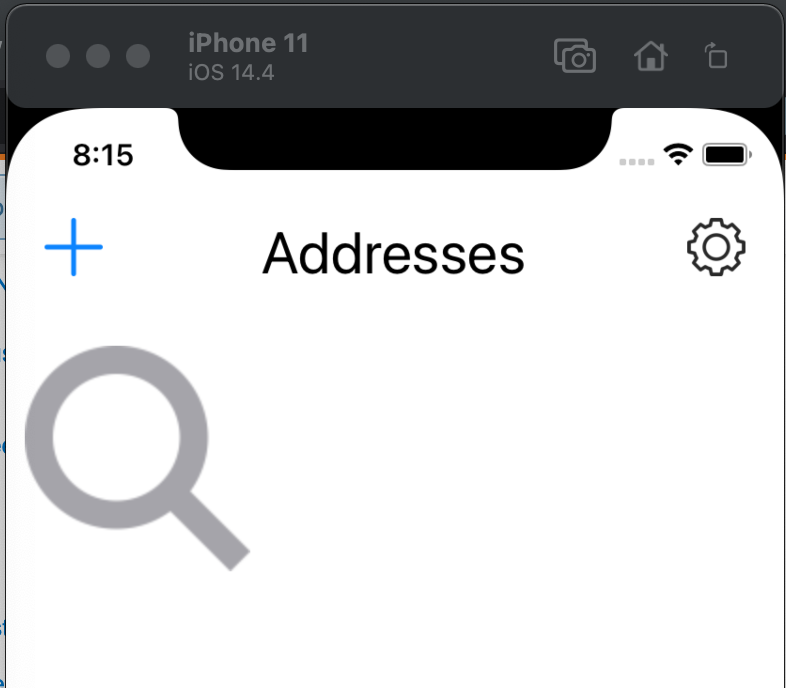

```
+-- Addresses
  --- Login
  --- Drop down menu
  --- Modal add address
+-- Address
  +-- Events
    --- Owner Info
    +-- Events
      +-- Add/edit event
        +-- Info
        +-- Tags
```

### Initial thoughts
One of the main things I'd like to avoid(along with past problems) in this new app is the way I did the components. I used the routes to render the components but I did it by flexing a component to do more than one thing. It should be the same component used in multiple screens and inside the screens is what flexes the component behavior. The screens are based on routes still.

I'll have to look at the old ToDo lists/problems I noted in the repo

### 04/28/2021
Feeling weak lately not sure why

Be like the movie Holes `"I'm tired grandpa!"` and he's like `"That's too damn bad! You keep diggin!"`

Probably not advisable but I'm going for "rapid feels" development. As in will get a lot of the screens/UI done first.

Before it actually works.

Gotta loop the mock sample event data to make the initial rows, going with route id approach

Gonna bust it out, little component

There's no bottom navigation in iOS this is a good thing. Just threw me off as I got stuck between routes/couldn't get back. Just refresh until the rest of the UI is built.

### 04/26/2021
Going to make PNGs of the SVGS sucks but whatever... I tried to get the SVG stuff to work but soy tonto.
Then I'll do the base layout for the search-type top navbar.

References:
https://reactnative.dev/docs/images
https://reactnative.dev/docs/pixelratio
https://stackoverflow.com/questions/34493372/what-is-the-default-unit-of-style-in-react-native
https://stackoverflow.com/questions/33628677/react-native-responsive-font-size

Starting to look like an app again... ehh slow progress today


### 04/25/2021
Slow progress... took up a new side job... will start to get going, hard starting from scratch.

Can't render SVGs directly in RN that's great

### 03/30/2021
Started the basic structure up. Primarily focusing on developing all the screens at the moment/following with basic routing. Then will do local state/data storage with sqlite and finally interface with the Node API.

Left on building out the navbars pretty much have to match the screenshots of existing app

### 03/27/2021

So I think I'll first work on the navbar, this changes based on route, I will get routing down too.
